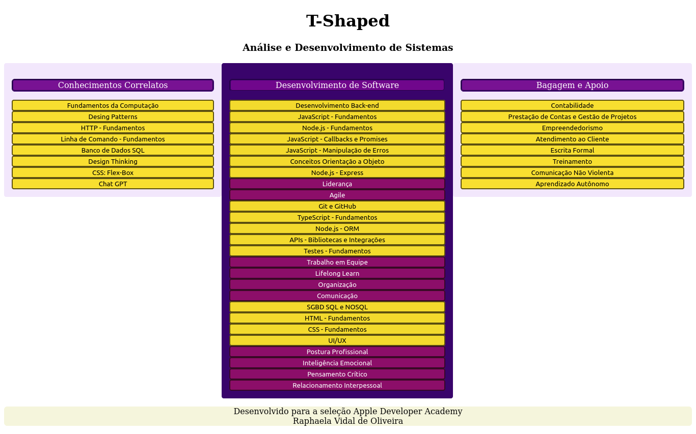

# T-shaped Skills (Habilidades em Forma de T)

## Menu do Projeto
- [O que é o T-shaped](https://github.com/raphavidall/T-shaped/new/main?readme=1#o-que-%C3%A9-o-t-shaped-skills-habilidades-em-forma-de-t)
- [Necessidade do Projeto](https://github.com/raphavidall/T-shaped/new/main?readme=1#necessidade-do-projeto)
- [Visualização do Projeto](https://github.com/raphavidall/T-shaped/new/main?readme=1#visualiza%C3%A7%C3%A3o-do-projeto)
- [Como Utilizar o Projeto](https://github.com/raphavidall/T-shaped/new/main?readme=1#como-utilizar-o-projeto)
- [Contribuir com o Projeto](https://github.com/raphavidall/T-shaped/new/main?readme=1#contribuir-com-o-projeto)

## O que é o T-shaped Skills
Este projeto consiste em uma estrutura base personalizável feita em HTML e CSS para construir um T-shaped pessoal/profissional.

O conceito de competências em forma de T, tem sido cada vez mais usado no recrutamento profissional para descrever as capacidades das pessoas no mercado de trabalho.
Como o nome sugere, a confecção visual do T-shaped forma literalmente uma letra T, onde os elementos posicionados verticalmente agregam a profundidade de competências
e conhecimentos relacionados num único campo(especialização do indivíduo), enquato os elementos da linha horizontal estão relacionadas aos conhecimentos mais generalista,
que de capacitam o indivíduo a integrar seus conhecimentos, colaborando entre disciplinas com especialistas de outras áreas e
de aplicando conhecimentos em áreas de especialização diferentes da sua. 

## Necessidade do projeto
Precisei construir um T-shaped para um processo seletivo e em minhas pesquisas no Google a fora não encontrei facilmente um modelo personalizável.
Resolvi criar este modelo aproveitando meu humilde conhecimento em HTML e CSS e disponibilizá-lo para que possa ajudar pessoas que também estejam procurando por isso.

## Visualização do projeto
Aqui está uma prévia da estrutura inicial do projeto:



## Como utilizar o projeto
Para utilizar o projeto, primeiramente você deve realizar um fork deste repositório. Em seguida poderá editar os arquivos do seu fork pelo próprio github ou
clonar o repositório em sua máquina local.

Para inserir suas informações, basta substituir os textos que estão nas tags:

```html
<title> 
<h1>
<h3>
<section>
<p>
<button>
```
Você também pode personalizar as cores que estão no 'styles.css' e o alinhamento dos itens. 

## Contribuir com o projeto
Se você gosta de brincar com o CSS, você pode melhorar o projeto e adicioná-lo a este repositório, me fazendo uma pull request.
